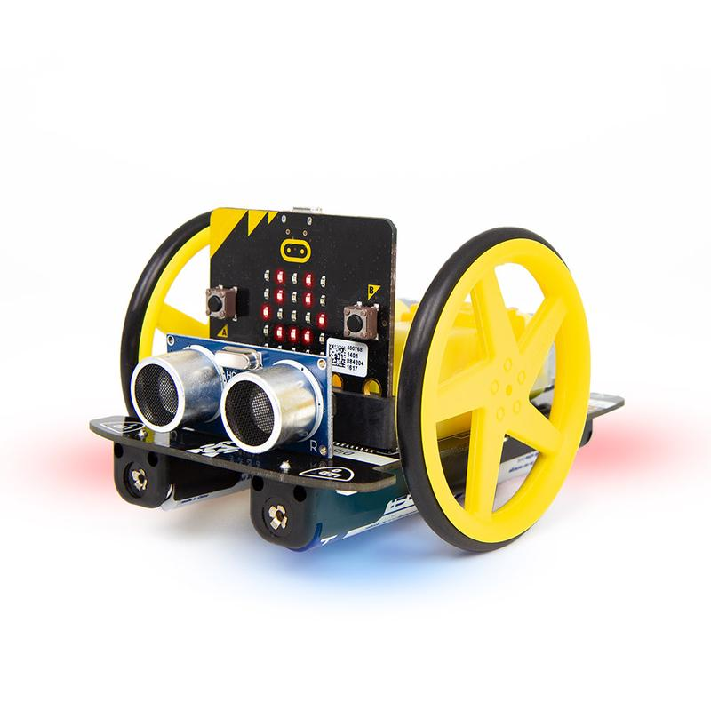
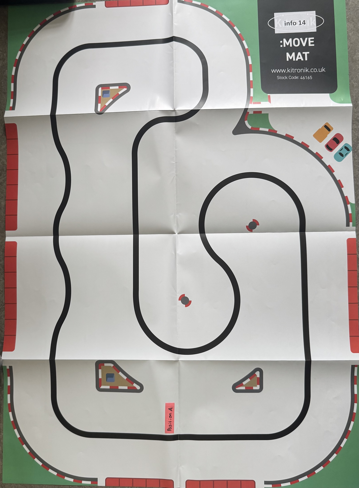

# Projet robotique

Option complémentaire en informatique du gymnase du Bugnon

## Description

Dans ce projet nous programmons le robot Kitronik Move.





## Partie obligatoire
Dans ce mini projet le robot:

- Importation des modules :
```
from microbit import *
from machine import time_pulse_us
import KitronikMOVEMotor 
import music
import time

```

- Initialisation du robot :
```
trigger = pin13
echo = pin14
prog = 0

trigger.write_digital(0)
echo.read_digital()

robot = KitronikMOVEMotor.MOVEMotor()
robot.move(0, 0)
# pince ouverte (pour la refermer après pour attraper objet)
robot.goToPosition(1, 160)
```

- Commence le parcours à une position A
- Temps entre la position A (début) et l'objet (même durée utilisé pour revenir à la position A) :
```
  init_time = running_time()
    
  robot.goToPosition(1, 160)
```   
  
- Va suivre une ligne (définition d'une fonction) :
```
def suivre_ligne():
    left = pin1.read_analog()
    right = pin2.read_analog()
    b = (left - right)
    b = b // 10
    robot.move(5 - b, 5 + b)    
```
   
- Va détecter un objet avec le capteur ultrason (position 0 variable):
```
def distance():
    trigger.write_digital(1)
    time.sleep_us(10)
    trigger.write_digital(0)
    d = time_pulse_us(echo, 1)/2e6*340*100 # *100 pour avoir en cm
    return round(d)
```
- Va tourner de 180 degrée et attraper l'objet (avec un petit bruitage):
```
def tourner():
    robot.move(70, -70, 1000)
    robot.move(0, 0)
    sleep(500)
tourner()
robot.move(-60, -60, 1000) # avance/recule afin de prendre l'objet
robot.goToPosition(1, 20)
music.play(sound, wait=False, loop=True)
sleep(1000)
```
- Va amener l'objet à la position A et le relâcher (attention, il ne le rammène pas à la position A, mais va juste ne ligne droite!!!) :
```
            t0 = time.ticks_ms()
            robot.move(60, 60)
            while distance() > 20:
                pass
            robot.move(0, 0)
            t1 = time.ticks_ms()
            dt = t1 - t0 # durée jusqu'à l'objet
            t2 = time.ticks_ms() + dt   # instant dans le futur ou il doit s'arreter
            robot.move(-60, -60)
            print(t1 - t0)
            while time.ticks_ms() < t2:
                pass
            robot.move(0, 0)
```
## Partie libre

Une partie complétement libre où le robot pourra faire:

- Une danse (définition d'une fonction) :
 ```
def danser():
    robot.move(120, 0, 1000) # tourne
    robot.goToPosition(1, 160) # ouvre pince 
    robot.goToPosition(1, 20) # ferme pince
    robot.move(0, 120, 1000) # tourne autre sens
    display.show(Image.HAPPY)
    sleep(500)
 ```
- Un petit bruitage quand l'objet est attrapé : sound = ['E4:4', 'G4:4', 'A4:4', 'E5:8']
- Un dessin :
```
            for i in range (5):
                robot.move(60, 60, 1000)
                robot.move(60, -60, 1000)
                robot.move(60, 60, 1000)
                robot.move(-30, 60, 1000)
```
- Un light-show
- Parler
- Faire de la musique

### Programme final
```
if prog == 8: 
        if button_b.is_pressed():
        # 1. Ouvrir la pince et démarrer le chronomètre
            robot.goToPosition(1, 160)
            sleep(300)
            t0 = time.ticks_ms()

        # 2. Suivre la ligne jusqu'à détecter un objet
            while distance() > 15:
                suivre_ligne()
            
        # 3. Arrêt + mesure du temps aller
            robot.move(0, 0)
            t1 = time.ticks_ms()
            dt = t1 - t0

        # 4. Demi-tour et fermeture de la pince
            tourner()
            robot.move(-60, -60, 1000) # avance/recule afin de prendre l'objet
            robot.goToPosition(1, 20)
            music.play(sound, wait=False, loop=True)
            sleep(500)

        # 5. Suivre la ligne pendant exactement le même temps qu'à l'aller
            t2 = time.ticks_ms()
            while time.ticks_diff(time.ticks_ms(), t2) < dt:
                suivre_ligne()

        # 6. Arrêter, déposer l'objet, danser
            robot.move(0, 0)
            robot.goToPosition(1, 160)
            sleep(500)
            danser()
            display.show(Image.HAPPY)
            sleep(500)

```

### Programme total
```
# Imports go at the top
from microbit import *
from machine import time_pulse_us
import KitronikMOVEMotor 
import music
import time
#import radio
#import neopixel
#import random

trigger = pin13
echo = pin14
prog = 0

trigger.write_digital(0)
echo.read_digital()

robot = KitronikMOVEMotor.MOVEMotor()
robot.move(0, 0)
# pince ouverte (pour la refermer après pour attraper objet)
robot.goToPosition(1, 160) 

def avancer(a):
    # avancer ou reculer de a centimètres
    a0 = 10.3 # distance de calibration
    if a>0:
        robot.move(120, 120, 20)
        robot.move(60, 60, a/a0*1000)
    else:
        robot.move(-120, -120, 20)
        robot.move(-60, -60, -a/a0*1000)

def distance():
    trigger.write_digital(1)
    time.sleep_us(10)
    trigger.write_digital(0)
    d = time_pulse_us(echo, 1)/2e6*340*100 # *100 pour avoir en cm
    return round(d)

def suivre_ligne():
    left = pin1.read_analog()
    right = pin2.read_analog()
    b = (left - right)
    b = b // 10
    robot.move(5 - b, 5 + b)
        
def tourner():
    robot.move(70, -70, 1000)
    robot.move(0, 0)
    sleep(500)
    
def danser():
    robot.move(120, 0, 1000) # tourne
    robot.goToPosition(1, 160) # ouvre pince 
    robot.goToPosition(1, 20) # ferme pince
    robot.move(0, 120, 1000) # tourne autre sens
    display.show(Image.HAPPY)
    sleep(500)

sound = ['E4:4', 'G4:4', 'A4:4', 'E5:8']

# Programme autonome : aller à un objet, le ramasser, et revenir à A (sur circuit fermé)
while True:
    # le bouton A incrémente les programmes (0..9)
    if button_a.was_pressed():
        robot.move(0, 0)
        prog = (prog + 1) % 10
        display.show(prog)
        music.pitch(440, 20)
        print('prog =', prog)

    if prog == 0:
        # tester le capteur ultrason
        t0 = time.ticks_ms()
        print(t0)
        sleep(1000)

    if prog == 1:
        # tester la fonction distance()
        # fonctionne la pluspart du temps, mais parfois ça retourne
        # 1003, 1007, 1005, etc.
        if button_b.is_pressed():
            d = distance()
            time.sleep_ms(100)
            print(d)

    if prog == 2:
        # tester suivie la ligne OK
        suivre_ligne()

    if prog == 3:
        # tester arrêt à 20 cm d'un obstacle
        if distance() > 20:
            suivre_ligne()
        else:
            robot.move(0, 0)

    if prog == 4:  
        # tester le chronomètre
        # le robot part avec bouton B, s'arrête à 10 cm d'un objet
        # affiche le temps dt dans la console
        # ensuite recule pendant dt milisecondes
        
        if button_b.is_pressed():
            t0 = time.ticks_ms()
            robot.move(60, 60)
            while distance() > 20:
                pass
            robot.move(0, 0)
            t1 = time.ticks_ms()
            dt = t1 - t0 # durée jusqu'à l'objet
            t2 = time.ticks_ms() + dt   # instant dans le futur ou il doit s'arreter
            robot.move(-60, -60)
            print(t1 - t0)
            while time.ticks_ms() < t2:
                pass
            robot.move(0, 0)

    if prog == 5:
        # tester 180 degrés
        # Demi-tour
        # Fermer pince (attraper objet)
        
        #robot.move(70, -70, 1000)
        #robot.move(0, 0)
        #sleep(500)
        tourner() # fonction pour tourner définie
        robot.move(-60, -60, 1000) # avance/recule afin de prendre l'objet
        robot.goToPosition(1, 20)
        music.play(sound, wait=False, loop=True)
        sleep(1000)

    # Essai passé
    if prog == 6:
        # Capteur ultrason : détection objet   
        if distance() < 20: # Si à moins de 20 cm (obstacle/objet) alors...
            stop = time.ticks_ms()
            start = 0
            duration = stop - start # Temps jusqu'à l'objet pour déterminer position A
            robot.move(0, 0)
            sleep(500)
            
            # Demi-tour
            robot.move(70, -70, 1000)
            robot.move(0, 0)
            sleep(500)
            
            # Fermer la pince
            robot.goToPosition(1, 20)
            sleep(1000)
            
            # Revenir à la position A en refaisant le même temps
            #duration # Faire même temps au retour qu'à l'aller
            left = pin1.read_analog()
            right = pin2.read_analog()
            d = (left - right)
            d = d // 20
            robot.move(5 - d, 5 + d)
                    
            robot.move(0, 0)
            sleep(500)
                    
            # Déposer l'objet
            robot.goToPosition(1, 160)
            sleep(1000)
                    
    if prog == 7:
        danser()
        music.play(sound)

    # Proramme final
    if prog == 8: 
        if button_b.is_pressed():
        # 1. Ouvrir la pince et démarrer le chronomètre
            robot.goToPosition(1, 160)
            sleep(300)
            t0 = time.ticks_ms()

        # 2. Suivre la ligne jusqu'à détecter un objet
            while distance() > 15:
                suivre_ligne()
            
        # 3. Arrêt + mesure du temps aller
            robot.move(0, 0)
            t1 = time.ticks_ms()
            dt = t1 - t0

        # 4. Demi-tour et fermeture de la pince
            tourner()
            robot.move(-60, -60, 1000) # avance/recule afin de prendre l'objet
            robot.goToPosition(1, 20)
            music.play(sound, wait=False, loop=True)
            sleep(500)

        # 5. Suivre la ligne pendant exactement le même temps qu'à l'aller
            t2 = time.ticks_ms()
            while time.ticks_diff(time.ticks_ms(), t2) < dt:
                suivre_ligne()

        # 6. Arrêter, déposer l'objet, danser
            robot.move(0, 0)
            robot.goToPosition(1, 160)
            sleep(500)
            danser()
            display.show(Image.HAPPY)
            sleep(500)                    
```            
## Difficultés rencontrées

Lors de ce projet, nous avons rencontré de nombreux problèmes et difficultés :
- gestion du temps
- le code ne fonctionnait pas ou qu'en partie : le robot n'avançait pas lors qu'on appuie sur le bouton b (démarre le code), il commençait à suivre le code seulement quand il détectait un objet
- la pince ne se fermait pas totalement pour un des robots (le code était correcte, le problème venait du robot)
- le deuxième robot s'allumait puis s'éteingnait encore et encore après un accident (chute)
- le premier capteur ne fonctionnait pas bien et le second capteur a un autre problème : il renvoie parfois des valeurs commme 1003 ou 1007, alors qu'il renvoyait par exemple que des valeurs entre 100 et 105
- Le robot ne reviens pas à la position A

## Piste d'amélioration

Beaucoup de choses auraient pu être mieux, on peut progresser :
- Faire plus attention à nos robots (plus d'accident, apprendre à les réparer en cas de soucis, etc.)
- Mieux gérer notre temps, apprendre à mieux s'organiser
- ...

## Ce qu'on a appris

Lors de ce projet, nous avons appris de nombreuses choses :
- Comprendre et bien utiliser Github
- Bien structurer du code
- Comment bien documenter (avec le README)
- Diverses connaissances sur la robotique (ex : composants d'un robot Kitronik)
- Nous avons élargi nos connaissances sur le language Python

## Documentation

Toute la documentation se trouvve dans ce ficher README.md

Vous devez utiliser:

- 3 niveaux de titres
- liste avec puces et numéroté
- des exemples de code
- des formules mathématiques
- des images
